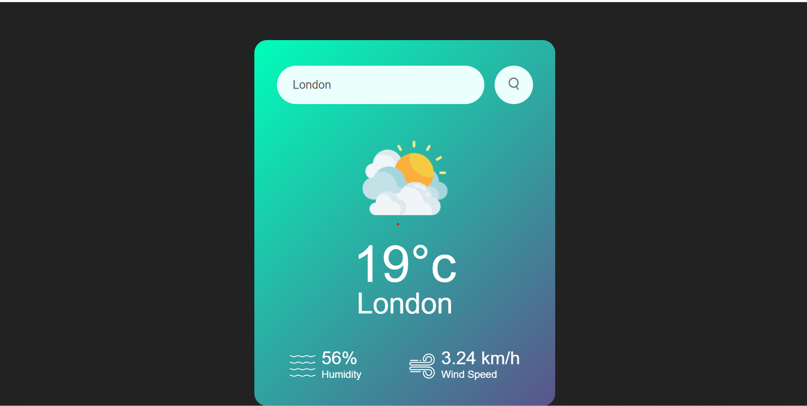

# 🌦️ Weather App

A simple weather application built using HTML, CSS, and JavaScript that allows users to search for the current weather conditions in any city using the OpenWeatherMap API.

## 🔧 Features

- 🌍 Search weather by city name
- 🌡️ View temperature in Celsius
- 💧 See humidity percentage
- 💨 Check wind speed
- 🖼️ Dynamic weather icons based on conditions
- ❌ Error handling for invalid city names

## 🚀 Live Demo

> _You can host this project using GitHub Pages, Vercel, Netlify, etc._

## 📸 Preview

 <!-- Replace with actual image or remove -->

## 🛠️ Technologies Used

- **HTML5**
- **CSS3**
- **JavaScript (ES6+)**
- **OpenWeatherMap API**

## 📁 Project Structure

weather-app/
├── images/
│ ├── clear.png
│ ├── clouds.png
│ ├── drizzle.png
│ ├── humidity.png
│ ├── mist.png
│ ├── rain.png
│ ├── search.png
│ └── wind.png
├── index.html
├── style.css
├── script.js
└── README.md


## 🔑 How to Use

1. Clone the repository:
   ```bash
   git clone https://github.com/your-username/weather-app.git
   cd weather-app
2. Open index.html in your browser.

3. Replace the placeholder API key in script.js with your own:

const apiKey = "YOUR_API_KEY"; // Get from https://openweathermap.org/api

